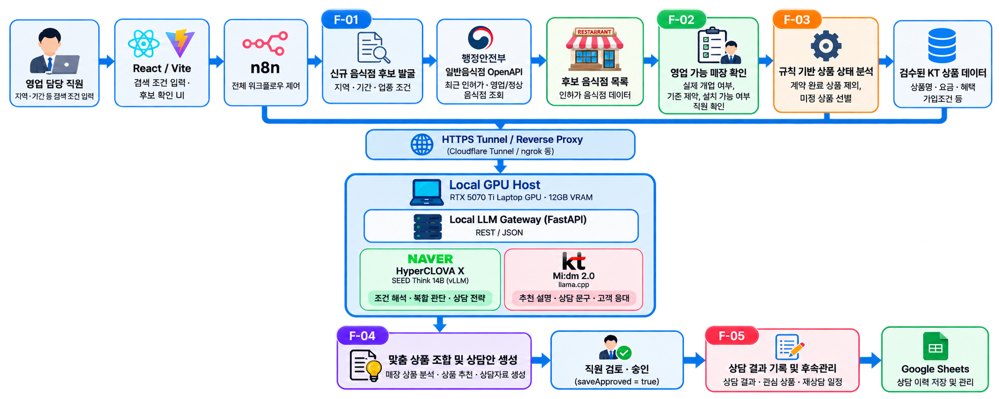

# 🚀 KT K-New Deal Academy Project

# KT Opportunity

> AI Agent-based Sales Opportunity Discovery and Proposal Generation
> Platform

KT Opportunity is an AI-powered sales support platform developed as part
of the **KT K-New Deal Academy Project**.

The platform discovers new business opportunities from restaurant data,
analyzes store conditions, recommends suitable KT products, generates
customized proposals, and manages follow-up workflows through an AI
Agent architecture.

------------------------------------------------------------------------

# 📌 Project Overview

  Category              Details
  --------------------- -----------------------------
  Project               KT Opportunity
  Program               KT K-New Deal Academy
  Domain                AI Agent / Sales Automation
  Current Version       V2.5 Foundation
  Frontend              React + Vite
  Workflow Automation   n8n
  API Gateway           FastAPI
  LLM Runtime           vLLM / llama.cpp

------------------------------------------------------------------------

# 🏗 System Architecture



## Architecture Flow

    User
     ↓
    React + Vite Frontend
     ↓
    n8n Agent Workflow
     ↓
    Restaurant Discovery & Analysis
     ↓
    KT Product Recommendation Engine
     ↓
    FastAPI LLM Gateway
     ↓
    Local LLM Runtime
     ↓
    Proposal Generation
     ↓
    Follow-up Management

------------------------------------------------------------------------

# 🤖 AI Agent Workflow

## Business Process

    F-01  Restaurant Discovery
              ↓
    F-02  Store Verification
              ↓
    F-03  Opportunity Analysis
              ↓
    F-04  Customized Proposal
              ↓
    F-05  Follow-up Management

## Key Capabilities

-   Restaurant opportunity discovery
-   Store status verification
-   KT product matching and recommendation
-   AI-generated sales proposals
-   Consultation history management
-   Idempotency-based duplicate prevention

------------------------------------------------------------------------

# 🧠 LLM Infrastructure

## Local LLM Model Stack

  ---------------------------------------------------------------------------
  Provider          Model                 Runtime           Purpose
  ----------------- --------------------- ----------------- -----------------
  NAVER Cloud       HyperCLOVA X SEED     vLLM              Agent reasoning
                    Think 14B                               and analysis

  KT                Mi:dm 2.0             llama.cpp         Korean response
                    Base-Instruct 11.5B                     generation

  Alibaba Cloud     Qwen3.5-9B            llama.cpp         General LLM
                                                            evaluation

  Microsoft         Phi-4-mini-instruct   llama.cpp         Lightweight
                    3.8B                                    inference testing

  Google            Gemma 4 12B IT        llama.cpp         General-purpose
                                                            LLM comparison
  ---------------------------------------------------------------------------

## Runtime Architecture

    NAVER Cloud HyperCLOVA X SEED Think 14B
                    |
                    | vLLM
                    |
            FastAPI LLM Gateway
                    |
                    |
            KT Mi:dm 2.0 Base-Instruct 11.5B
                    |
                    | llama.cpp

## Operating Principles

-   Optimized for NVIDIA RTX 5070 Ti Laptop GPU
-   Designed for 12GB VRAM environments
-   Only one LLM model is loaded on GPU at a time
-   Direct browser access to inference endpoints is prohibited
-   All AI requests pass through the FastAPI Gateway boundary

------------------------------------------------------------------------

# ⚙️ Technology Stack

## Frontend

  Technology   Usage
  ------------ ----------------
  React 19     User Interface
  Vite 7       Build System

## Backend & Automation

  Technology   Usage
  ------------ ------------------------------
  FastAPI      LLM Gateway and API Boundary
  n8n          Workflow Automation
  Docker       Runtime Environment

## AI Platform

  Technology     Usage
  -------------- ------------------------------
  vLLM           High-performance LLM Serving
  llama.cpp      Local LLM Runtime
  Hugging Face   Model Management

------------------------------------------------------------------------

# 📊 Engineering Highlights

## AI Agent Engineering

-   Workflow-based Agent architecture
-   F-01 \~ F-05 business process validation
-   Rule-based opportunity analysis

## Data Reliability

-   API Contract validation
-   Product Catalog validation
-   Consultation history contract
-   Idempotency handling

## Frontend Engineering

-   Responsive UI design
-   Accessibility-focused implementation
-   Workflow state management
-   Operational error recovery

------------------------------------------------------------------------

# 📈 Project Evolution

    KT Sales Agent

    V0.1  Functional MVP
      ↓
    V0.4  Reliability & Persistence
      ↓
    V1    Project Pivot to KT Opportunity
      ↓
    V2    Product Architecture Rewrite
      ↓
    V2.4  FINAL Release Baseline
      ↓
    V2.5  Foundation Phase

------------------------------------------------------------------------

# 🧪 Validation

Run:

``` bash
npm test
npm run build
```

Validation Coverage:

-   Workflow rule validation
-   API contract validation
-   Proposal catalog validation
-   Save approval gate
-   Idempotency testing
-   Production build verification

------------------------------------------------------------------------

# 📂 Repository Structure

    KT-Opportunity
    │
    ├── src
    │   ├── features
    │   ├── components
    │   ├── services
    │   └── domain
    │
    ├── docs
    │   ├── ARCHITECTURE.md
    │   ├── VERSION_LINEAGE.md
    │   ├── CHANGELOG.md
    │   └── images
    │       └── architecture.png
    │
    ├── scripts
    ├── deploy
    ├── package.json
    └── README.md

------------------------------------------------------------------------

# 📌 Version

Current Release:

    KT Opportunity V2.5 Foundation

Based on:

    KT Opportunity V2.4 FINAL Release Baseline
